# Edge_Detection
Implementation and testing of computer vision edge detection algorithms 

## Hough Lines
* ## Example 1
    ### 1- Loading the original Image 
    

     

    ### 2-  Applying Hough Line
    
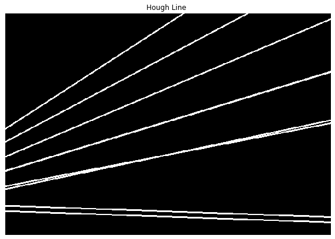

     

    ### 3-  Superimposing the Hough Line output binary image over the Original image
    

     
* ## Example 2
    ### 1- Loading the original Image 
    
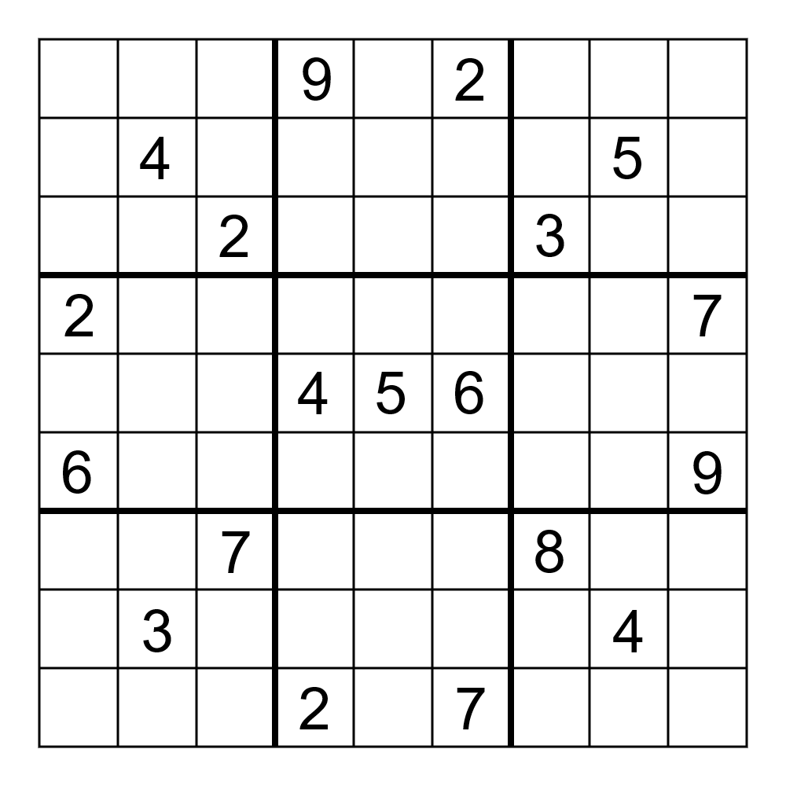

     

    ### 2-  Applying Hough Line
    
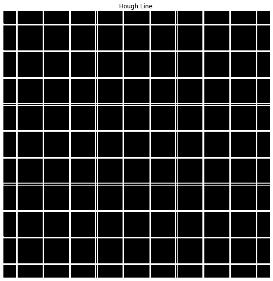

     

    ### 3-  Superimposing the Hough Line output binary image over the Original image
    

     

## Hough Circles
* ## Example 1
    ### 1- Creating Image that contain different circles
    
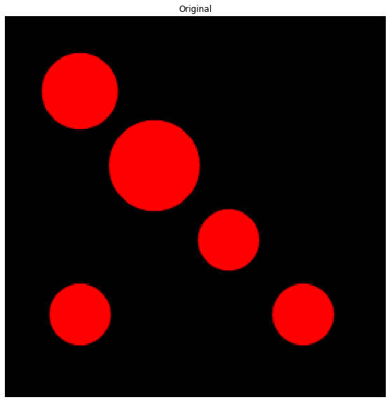

     

    ### 2- Applying Hough Circles
    
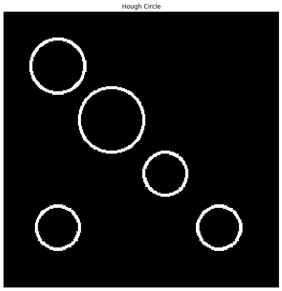

     

    ### 3-  Superimposing the Hough Circles output binary image over the Original image
    
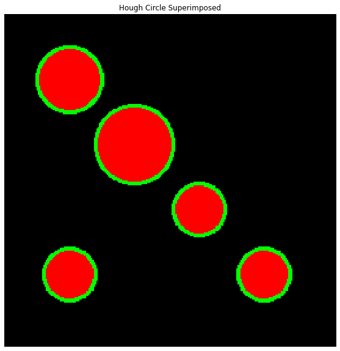

     

* ## Example 2
    ### 1- Loading the original Image 
    
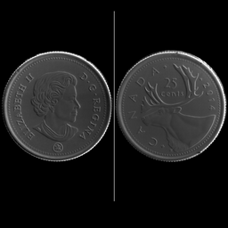

     

    ### 2- Applying Hough Circles
    
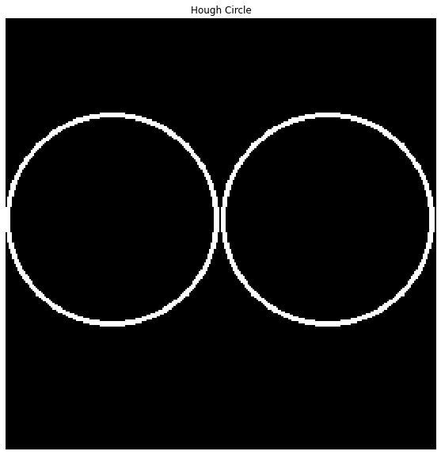

     

    ### 3-  Superimposing the Hough Circles output binary image over the Original image
    

     

## Active Contour
* ## Example 1
    ### 1- Loading the original Image
    
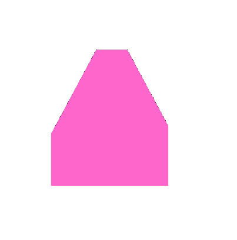

     

    ### 2- Contour Initialization
    
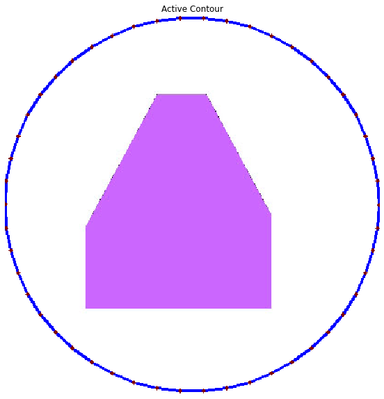

     

    ### 3-  Evolving the Active Contour Model (snake) using the greedy algorithm on the object
    
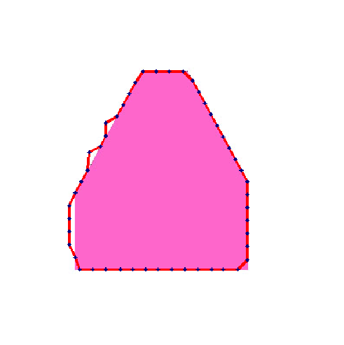

     
